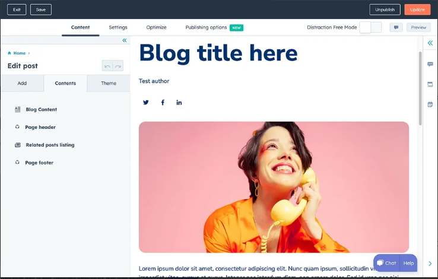

# 📘 Blog Application

A short and clear description of your project and what it does.

---


## 🚀 Features

- ✅ MVC 
- ⚡ Image upload through URL
- 🔒 Session (Encryption)

---

## 🛠️ Tech Stack

- Frontend: HTML, CSS, JavaScript
- Backend: Node.js, Express
- Database: MongoDB / MySQL

---

## 📸 Screenshots



---

## 📦 Installation

```bash
git clone https://github.com/your-username/your-repo.git
cd your-repo
npm install
npm start